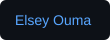

  <h1>Frontend Developer</h1>
  

 🚀 Technical Architect  | 👑 Royalty by Design

  Applied Computer Science | IT student

🧠 Philosophy & Principles

> "Is your net-working?" — *Orator Walubengo Bennyhinn*

<section>
  <h2>Contact</h2>
 🤝 Connect with Me

- **Email:** <a href="mailto:elseyouma@gmail.com" target="_blank">elseyouma@gmail.com</a>
- Location: 📍Nairobi,Kenya
- <button>
<a class="badge-base__link LI-simple-link" href="https://ke.linkedin.com/in/elsey-ouma-20b757355?trk=profile-badge">LinkedIn</a>
</button>
              
 </section>
  
<footer>

Every generation has its battles to conquer. This is mine.🚀

</footer>

## 📊 GitHub Stats

<h2>Profile views</h2>

<h2>Tech Stack & Tools</h2>

<!--
**elseyhub/elseyhub** is a ✨ _special_ ✨ repository because its `README.md` (this file) appears on your GitHub profile.

Here are some ideas to get you started:

- 🔭 I’m currently working on ...
- 🌱 I’m currently learning ...
- 👯 I’m looking to collaborate on ...
- 🤔 I’m looking for help with ...
- 💬 Ask me about ...
- 📫 How to reach me: ...
- 😄 Pronouns: ...
- ⚡ Fun fact: ...
-->
